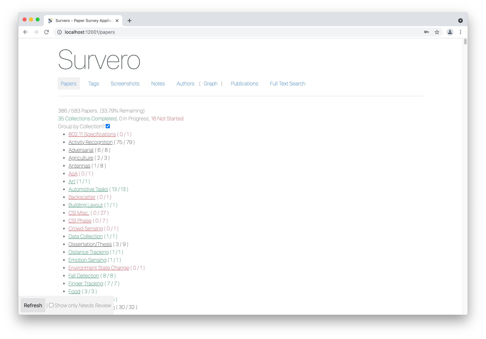

## Survero (Survey Web Application for Zotero)

Steven M. Hernandez



Zotero offers an easy method for collecting and reviewing research papers.  
A special feature of zotero is that it produces a read-only `.sqlite` file which we can query for more complex analysis.

With this local database, I built a custom web application called **Survero** (survey+zotero) to make collecting notes, screenshots and search even easier!

To use this tool, first you will need to add the `zotero.sqlite` file from your local system.
There are two options for adding the `zotero.sqlite` file into the project. 
**YOU** must decide which one is safest and most applicable to your unique situation.

1. Symlink `ln -s /Users/your_name/Zotero/zotero.sqlite ~/volumes/zotero/` (on Mac)
2. Copy the file `cp /Users/your_name/Zotero/zotero.sqlite ~/volumes/zotero/` 

Next, you will want to edit the `.env` file:

```
cp ~/python/survero/.env-example ~/python/survero/.env 
vim ~/python/survero/.env
```

After this, you should be able to start survero through the terminal and open in a web browser.

```
# Start Survero
docker-compose up -d  # If there are problems, remove `-d` and watch the logs for any error messages.
```

The following tasks need to be run only the first time you start your server:

```
# Generate Encryption Key
docker-compose exec survero python craft key

# Create Database
docker-compose exec survero python craft migrate
```

Currently there is no easy way to create a new user. 
To register a new user open `./routes/web.py` and uncomment the lines starting with:

`Get("/register" ...` and `Post("/register" ...`. After this, head to `http://localhost:12000/register` to create a new account.

These paths are not enabled by default because we usually do not want people registering random accounts.

# Create Your User
```
# Open in Browser
open http://localhost:12000
```

Survero stores all new data such as tags, screenshots-metadata in a new `.sqlite` file located at `~/volumes/survero/survero.sqlite`.
